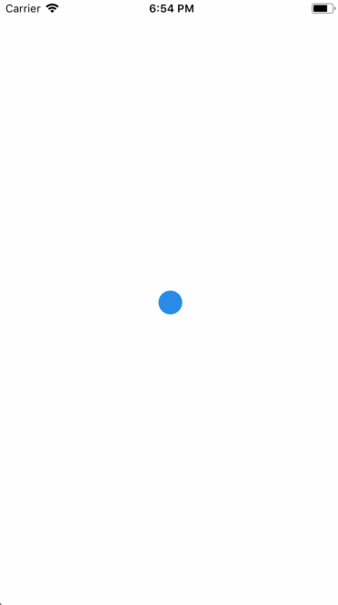

Animations are very important to create a great user experience. Animations allow you to convey physically believable motion in your interface. The Animated API is designed to make it very easy to concisely express a wide variety of interesting animation and interaction patterns in a very performant way. Here Are Few Examples.

## Introduction

Animations are a useful tool to boost the user experience and hence it must be utilised to the fullest, meaning there are mainly two ways you can animate components:

• To build from ground up, one can use an animation library such as React Native's Animated API and animate components such as `view` or `text`.
• Import animations from animation tools like After Effects (using Lottie).

Let's take a look at how we can achieve the former approach in this section with the help of a simple grow animation.

## The Grow Effect

First, import the required components and set up the `template` section.

```html
<template>
  <view class="container" >
      <animated:view
     class="growth-animated-view"
        :style="{
          height: growth,
          width: growth ,
          borderRadius:growth,
          }"
          />
</view>
</template>
```

```js
<script>import {(Animated, Easing)} from "react-native";</script>
```

The template section comprises of an "animated" view and another view wrapped around it. The `animated:view` has inline variable style properties for `height`,`width`, and `borderRadius`. All of these are provided with an animated value `growth` which is intialised when the component is `created`.

All the variable style properties are inline and the others can be provided using the class names as shown below:

```css
<style>
.growth-animated-view {
  background-color: "rgb(0, 138, 231)";
  align-self: center;
}

.container {
  justify-content: center;
  flex: 1;
}
</style>
```

The first step when starting an animation is to know our start and end frames and how the values of the components need to change in order to move from the start frame to the end.

<div style="display: flex;" class="flex-column exam-app">
            <div class="card" style="margin-right:30px;">
                <h4><a target="_blank" >Start frame</a></h4>
                <p> </p>
                
            </div>
            <div class="card">
                <h4> <a target="_blank" >End frame</a></h4>
                <p> </p>
                
            </div>
</div>

In this case, since we are creating a simple "grow" effect on a circular element, our start frame will be an `animated:view` with all the three properties having the value zero. Basically, our start frame will be a blank screen since the `growth` value is set to zero when the component is `created`.

The end frame is a view that has the background color blue and height, width, border radius as 200.

Now the goal is to provide a set of values to `growth` so that the same component is render for each value and appears to "grow".

The `script` section is structured in this manner and the function used is also shown below :

```js
<script>
import { Animated, Easing } from "react-native";

export default {
  data: function() {
    return {
      growth: 0
    };
  },
  created: function() {
    this.growth = new Animated.Value(0);
  },
  mounted: function() {
    this.animateGrowth();
  },
  methods: {
    animateGrowth: function() {

      this.growth.setValue(0);

      Animated.timing(this.growth, {
        toValue: 200,
        duration: 1000,
        easing: Easing.linear
      }).start(() => {
        // this.animateGrowth();
      });
    }
  }
};
</script>
```

The above section has the following functions :

•`created` to initialise our values.
• `data` function to define the data that will be used in our templates and functions.
• `mounted` to call the function to animate our component.
• Finally the `methods` sections which contain all the functions.

`Animated.timing` type from the Animated API is used to provide values to `growth` from 0 to 200 in the duration of 1000 milliseconds. Once this line executes, the `animated.view` starts to show the `growth` effect where it's value gradually increses from 0 to 200 and this is possible without `setstate` because of `Vue`'s DOM and data binding.

This is the result of the above code snippet :

<div class="hello-world-container">
  <div class="hello-world-wrapper">
    
  </div>
</div>

`Interpolate` is another feature that can be used to interpolate any value. An interpolation maps input ranges to output ranges, typically using a linear interpolation but also supports easing functions.

In order to reverse this animation, i.e take the component from end frame to the start frame is as easy as interpolating a value. For this purpose , take another value named `growthValue` and use it with the `Animated.timing` as shown below :

```js
<script>
export default {
  data: function() {
    return {
      growthValue: 0,
      growth: 0,
    };
  },
  created: function() {
    this.growthValue = new animated.Value(0);
    this.animatedValueRotate = new animated.Value(0);
  },
  mounted: function() {
    this.animateGrowth();
  },
  methods: {
    animateGrowth: function() {
      this.growthValue.setValue(0);
      Animated
        .timing(this.growthValue, {
          toValue: 1,
          duration: 1000,
          easing: Easing.linear
        })
        .start(() => {
          // this.animateGrowth();
        });
      this.growth = this.growthValue.interpolate({
        inputRange: [0, 0.5, 1],
        outputRange: [0, 200, 0]
      });
    }
  }
};
</script>
```

`growthValue.interpolate` is a simple mapping to convert a 0-1 range to a 0-200 range which produces the following effect :

<div class="hello-world-container">
  <div class="hello-world-wrapper">
    
  </div>
</div>

Now to repeat the same animation, add a recursive call inside the `start` function callback by uncommenting the above code.

<div class="hello-world-container">
  <div class="hello-world-wrapper">
    
  </div>
</div>

Refer the [community support](http://staging-vue-native.geekydev.com/docs/community-support.html) section for more details on how to use animation tools in Vue-native.
