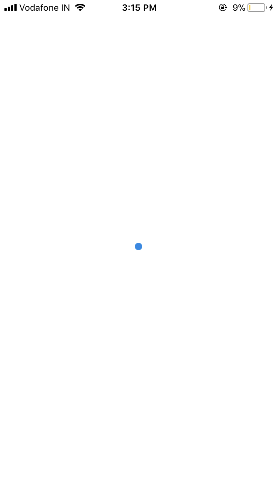
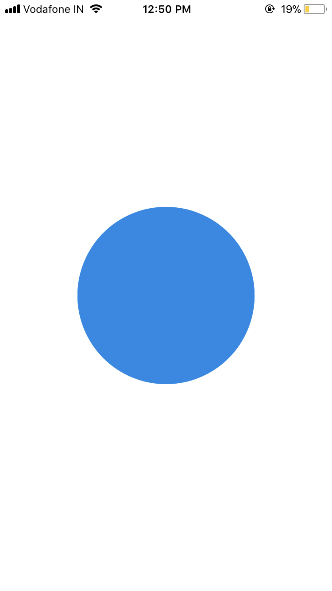
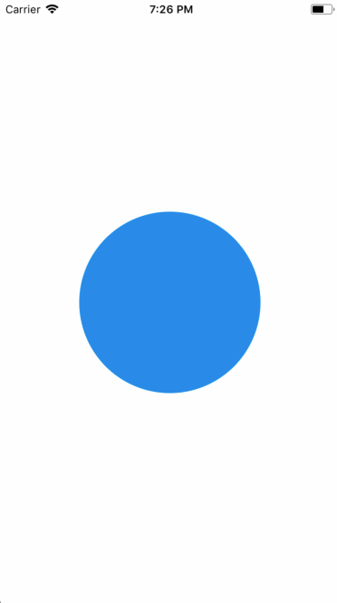
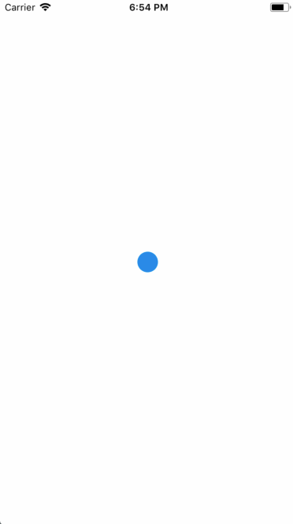
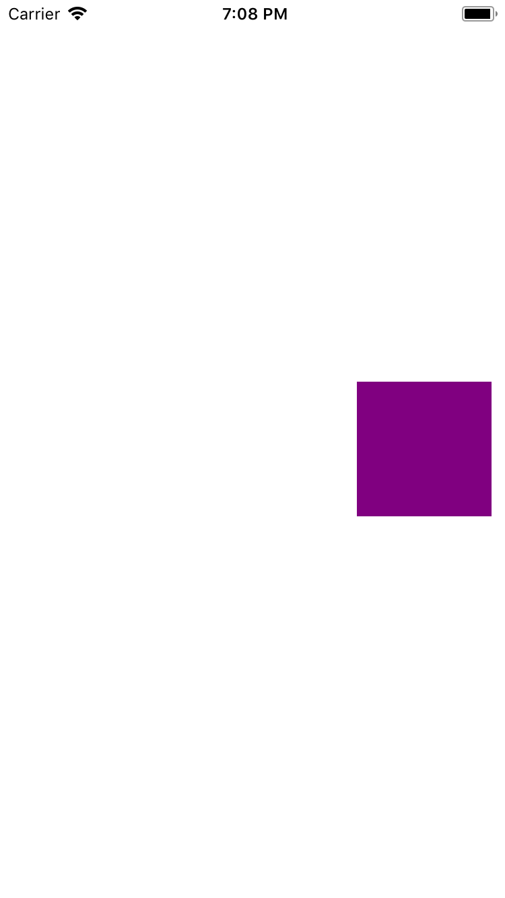
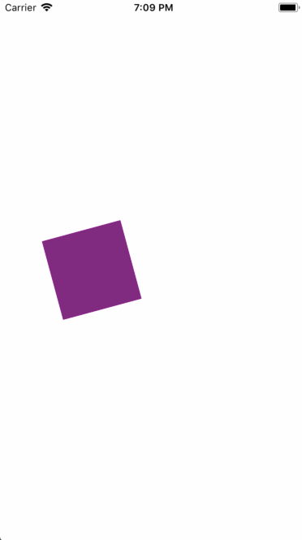
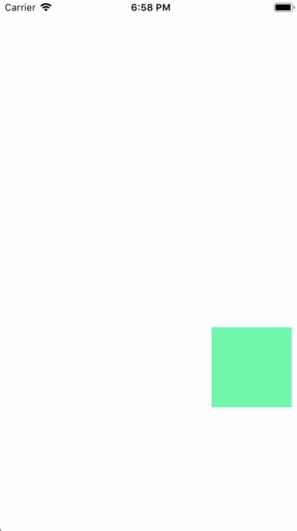
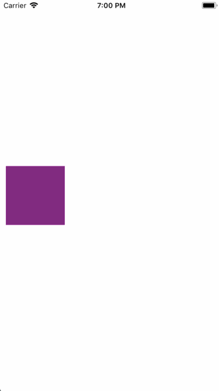
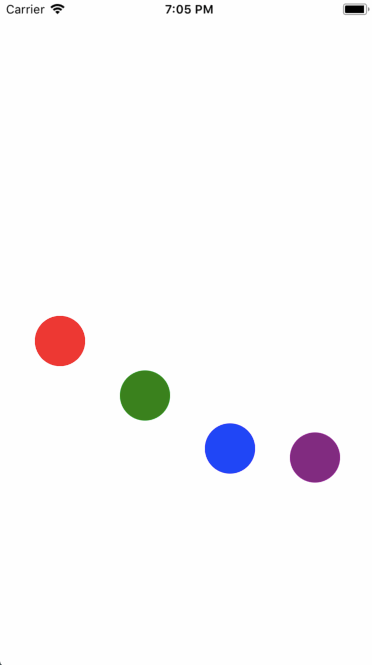
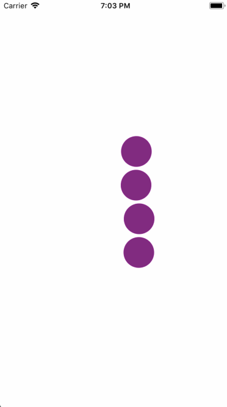

Animations are very important to create a great user experience. Animations allow you to convey physically believable motion in your interface. The Animated API is designed to make it very easy to concisely express a wide variety of interesting animation and interaction patterns in a very performant way. Here are few examples.

## Introduction

Animations are a useful tool to boost the user experience and hence it must be utilised to the fullest, meaning there are mainly two ways you can animate components:

• To build from ground up, one can use an animation library such as React Native's Animated API and animate components such as `view` or `text`.
• Import animations from animation tools like After Effects (using Lottie).

Let's take a look at how we can achieve the former approach in this section with the help of a simple grow animation.

## The Grow Effect

First, set up the `template` section.

```html
<template>
  <view class="container" >
    <animated:view
      class="growth-animated-view"
      :style="{
        height: growth,
        width: growth ,
        borderRadius:growth,
      }"
    />
  </view>
</template>
```

The template section comprises of an "animated" view and another view wrapped around it. The `animated:view` has inline variable style properties for `height`,`width`, and `borderRadius`. All of these are provided with an animated value `growth` which is intialised when the component is `created`.

All the variable style properties are inline and the others can be provided using the class names as shown below:

```css
<style>
.growth-animated-view {
  background-color: "rgb(0, 138, 231)";
  align-self: center;
}

.container {
  justify-content: center;
  flex: 1;
}
</style>
```

The first step when starting an animation is to know our start and end frames and how the values of the components need to change in order to move from the start frame to the end.

<div style="display: flex;" class="flex-column exam-app">
<div class="card">
  <h4 style="text-align:center">Start frame</h4>
<div class="hello-world-container">
  <div class="hello-world-wrapper">
    
  </div>
</div>
</div>
<div class="card">
    <h4 style="text-align:center"> End frame</h4>
      <div class="hello-world-container">
  <div class="hello-world-wrapper">
    
  </div>
</div>
</div>
</div>

In this case, since we are creating a simple "grow" effect on a circular element, our start frame will be an `animated:view` with all the three properties having the value zero. Basically, our start frame will be a blank screen since the `growth` value is set to zero when the component is `created`.

The end frame is a view that has the background color blue and height, width, border radius as 200.

Now the goal is to provide a set of values to `growth` so that the same component is render for each value and appears to "grow".

The `script` section is structured in this manner and the function used is also shown below :

```js
<script>
import { Animated, Easing } from "react-native";

export default {
  data: function() {
    return {
      growth: 0
    };
  },
  created: function() {
    this.growth = new Animated.Value(0);
  },
  mounted: function() {
    this.animateGrowth();
  },
  methods: {
    animateGrowth: function() {

      this.growth.setValue(0);

      Animated.timing(this.growth, {
        toValue: 200,
        duration: 1000,
        easing: Easing.linear
      }).start(() => {
        // this.animateGrowth();
      });
    }
  }
};
</script>
```

The above section has the following functions :

•`created` to initialize our values.
• `data` function to define the data that will be used in our templates and functions.
• `mounted` to call the function to animate our component.
• Finally the `methods` sections which contain all the functions.

`Animated.timing` type from the Animated API is used to provide values to `growth` from 0 to 200 in the duration of 1000 milliseconds. Once this line executes, the `animated.view` starts to show the `growth` effect where it's value gradually increses from 0 to 200 and this is possible without `setstate` because of `Vue`'s DOM and data binding.

This is the result of the above code snippet :

<div class="hello-world-container">
  <div class="hello-world-wrapper">
    
  </div>
</div>

`Interpolate` is another feature that can be used to interpolate any value. An interpolation maps input ranges to output ranges, typically using a linear interpolation but also supports easing functions.

In order to reverse this animation, i.e take the component from end frame to the start frame is as easy as interpolating a value. For this purpose , take another value named `growthValue` and use it with the `Animated.timing` as shown below :

```js
<script>
export default {
  data: function() {
    return {
      growthValue: 0,
      growth: 0,
    };
  },
  created: function() {
    this.growthValue = new animated.Value(0);
    this.animatedValueRotate = new animated.Value(0);
  },
  mounted: function() {
    this.animateGrowth();
  },
  methods: {
    animateGrowth: function() {
      this.growthValue.setValue(0);
      Animated
        .timing(this.growthValue, {
          toValue: 1,
          duration: 1000,
          easing: Easing.linear
        })
        .start(() => {
          // this.animateGrowth();
        });
      this.growth = this.growthValue.interpolate({
        inputRange: [0, 0.5, 1],
        outputRange: [0, 200, 0]
      });
    }
  }
};
</script>
```

`growthValue.interpolate` is a simple mapping to convert a 0-1 range to a 0-200 range which produces the following effect :

<div class="hello-world-container">
  <div class="hello-world-wrapper">
    
  </div>
</div>

Now to repeat the same animation, add a recursive call inside the `start` function callback by uncommenting the above code.

<div class="hello-world-container">
  <div class="hello-world-wrapper">
    
  </div>
</div>

## Spin and Glide Animation

The animation properties in our `animatedView` component is `marginLeft` and `rotate` property of `tranform`.

```html
<template>
  <view class="conatiner">
     <animatedView
        class="animated-view-style"
        :style="{
          marginLeft: movingMargin,
          transform: [{rotate: spin}],
        }"
      />
  </view>
</template>
```

```css
<style>
.animated-view-style{
    height: 100;
    width: 100 ;
    background-color: 'purple';
}
.container{
    justify-content: 'center';
    flex:1;
}
</style>
```

Our `data` and `created` functions :

```js
data: function() {
    return {
      spinValue: 0,
      spin: "0deg",
      animatedValueRotate: 0,
      movingMargin: 0
    };
  },
  created: function() {
    this.spinValue = new animated.Value(0);
    this.animatedValueRotate = new animated.Value(0);
  },
```

Let's take a look at the start and end frames of our animation.

<div style="display: flex;" class="flex-column exam-app">
<div class="card">
  <h4 style="text-align:center">Start frame</h4>
<div class="hello-world-container">
  <div class="hello-world-wrapper">
    
  </div>
</div>
</div>
<div class="card">
    <h4 style="text-align:center"> End frame</h4>
      <div class="hello-world-container">
  <div class="hello-world-wrapper">
    
  </div>
</div>
</div>
</div>

The `animateRotate` function makes use of the the `animated.sequence` and `animated.parallel` types. Let's take a look at the code that first `spins` the container.

```js
animationRotate: function() {
  this.spinValue.setValue(0);
  this.animatedValueRotate.setValue(0);

  animated
    .sequence([
      animated.parallel([
        animated.timing(this.spinValue, {
          toValue: 1,
          duration: 2000,
          easing: Easing.linear
        }),
        animated.timing(this.animatedValueRotate, {
          toValue: 1,
          duration: 2000,
          easing: Easing.linear
        })
      ]),
      animated.parallel([
        animated.timing(this.spinValue, {
          toValue: 0,
          duration: 2000,
          easing: Easing.linear
        }),
        animated.timing(this.animatedValueRotate, {
          toValue: 0,
          duration: 2000,
          easing: Easing.linear
        })
      ])
    ])
    .start(() => {
      this.animationRotate();
    });

  this.spin = this.spinValue.interpolate({
    inputRange: [0, 1],
    outputRange: ["0deg", "360deg"]
  });
}
```

The `spin` value interpolates from 0 to 360.

<div class="hello-world-container">
  <div class="hello-world-wrapper">
    
  </div>
</div>

Now, change `movingMargin` values by adding the following in the above function :

```
this.movingMargin = this.animatedValueRotate.interpolate({
    inputRange: [0, 1],
    outputRange: [0, width]
});
```

The `movingMargin` from 0 to the width of the screen.

<div class="hello-world-container">
  <div class="hello-world-wrapper">
    
  </div>
</div>

## Flip and Color change animation

The animated properties are :

• marginLeft
• marginTop
• backgroundColor
• transform

```html
<template>
  <view class="container">
    <animatedView
      class="animated-view-style"
      :style="{
        marginLeft: marginLeft,
        marginTop: marginTop,
        backgroundColor: interpolateColor,
        transform: [{rotateY},{rotateX}]
      }"
    />
  </view>
</template>
```

```css
<style>
.animated-view-style{
    height: 100;
    width: 100;
}
.container{
    padding:40;
}
</style>
```

Let's first build the first half of the animation and then the other half is just reversing the same.

```js
animated.sequence([
  animated.parallel([
    animated.timing(this.animatedValue, {
      toValue: 1,
      duration: this.duration,
      easing: Easing.linear
    }),
    animated.timing(this.animatedValue1, {
      toValue: 1,
      duration: 1000,
      easing: Easing.linear
    }),
    animated.timing(this.animatedColorValue, {
      toValue: 150,
      duration: 1000
    })
  ]),

  animated.parallel([
    animated.timing(this.animatedValue2, {
      toValue: 1,
      duration: this.duration,
      easing: Easing.linear
    }),
    animated.timing(this.animatedValue1a, {
      toValue: 1,
      duration: 1000,
      easing: Easing.linear
    })
  ]),

    ...

    ...

]).start();

this.marginLeft = 0;
this.marginTop = 0;
this.marginLeft = this.animatedValue.interpolate({
  inputRange: [0, 1],
  outputRange: [0, 200]
});

this.rotateY = this.animatedValue1.interpolate({
  inputRange: [0, 1],
  outputRange: ["0deg", "180deg"]
});

this.interpolateColor = this.animatedColorValue.interpolate({
  inputRange: [0, 150],
  outputRange: ["rgb(128,0,128)", "rgb(51, 250, 170)"]
});

this.marginTop = this.animatedValue2.interpolate({
  inputRange: [0, 1],
  outputRange: [0, 200]
});

this.rotateX = this.animatedValue1a.interpolate({
  inputRange: [0, 1],
  outputRange: ["0deg", "180deg"]
});
```

The above code snippet produces the following :

<div class="hello-world-container">
  <div class="hello-world-wrapper">
    
  </div>
</div>

Notice how all the `toValue` in each of the `animated.timing` type have value 1.
Now reversing is as easy as making these to 0 and appending it to `animated.sequence`.
The completed animation looks like this :

<div class="hello-world-container">
  <div class="hello-world-wrapper">
    
  </div>
</div>

## The Loading Animation

The animated property here is `marginBottom`.

Since all four animations need to happen with some sort of delay and because we are using `stagger` type, we will have differnt marginBottom values for each of these components.

```html
<template>
  <view class="parent-container" >
    <view class="container">
      <animatedView
        class="animated-view-style"
        :style="{
          marginBottom: movingMargin,
          backgroundColor: 'red',
        }"
      />
      <animatedView
        class="animated-view-style"
        :style="{
          marginBottom: movingMargin1,
          backgroundColor: 'green',
        }"
      />
      <animatedView
        class="animated-view-style"
        :style="{
          marginBottom: movingMargin2,
          backgroundColor: 'blue',
        }"
      />
      <animatedView
        class="animated-view-style"
        :style="{
          marginBottom: movingMargin3,
          backgroundColor: 'purple',
        }"
      />
    </view>
  </view>
</template>
```

```css
<style>
.animated-view-style{
    height: 50;
    width: 50;
    border-radius:50;
}
.container{
    flex-direction:'row';
    justify-content:'space-evenly';
    align-items:'flex-end';
    height:300;
}
.parent-container{
    flex-direction:'column';
    justify-content:'center';
}
</style>
```

Jumping into our animation function ,

```js
animate: function() {
  this.animatedValue.setValue(0);
  this.animatedValue1.setValue(0);
  this.animatedValue2.setValue(0);
  this.animatedValue3.setValue(0);

  animated.stagger(100, [
      animated.timing(this.animatedValue3, {
        toValue: 2,
        duration: this.duration,
        easing: Easing.linear
      }),

      animated.timing(this.animatedValue2, {
        toValue: 2,
        duration: this.duration,
        easing: Easing.linear
      }),

      animated.timing(this.animatedValue1, {
        toValue: 2,
        duration: this.duration,
        easing: Easing.linear
      }),
      animated.timing(this.animatedValue, {
        toValue: 2,
        duration: this.duration,
        easing: Easing.linear
      })
  ]).start(event => {
    if (event.finished) {
      this.animate();
    }
  });
  this.movingMargin = this.animatedValue.interpolate({
    inputRange: [0, 0.5, 1, 1.5, 2],
    outputRange: [0, 200, 0, 200, 0]
  });
  this.movingMargin1 = this.animatedValue1.interpolate({
    inputRange: [0, 0.5, 1, 1.5, 2],
    outputRange: [0, 200, 0, 200, 0]
  });
  this.movingMargin2 = this.animatedValue2.interpolate({
    inputRange: [0, 0.5, 1, 1.5, 2],
    outputRange: [0, 200, 0, 200, 0]
  });
  this.movingMargin3 = this.animatedValue3.interpolate({
    inputRange: [0, 0.5, 1, 1.5, 2],
    outputRange: [0, 200, 0, 200, 0]
  });
}
```

The `animated.stagger` executes each of the animation types provided to it at a delay of `100`. Meaning the second animation is started after 100 ms after the first one starts and so on.

<div class="hello-world-container">
  <div class="hello-world-wrapper">
    
  </div>
</div>

## Stagger Animation

This is simialr to the previous animation but here we combine the staggered animation from the previous step with a `spring` animation at the end of it. The animated properties include `marginLeft` and `left`.

The below snippet shows just one component using these animated properties :

```html
<animatedView
  class = "animated-view-style"
  :style="{
    marginLeft: movingMargin,
    left: springValue,
    backgroundColor: 'purple',
  }"
/>
```

```css
<style>
.animated-view-style{
    height: 50;
    width: 50;
    border-radius:50;
}
</style>
```

The animation function is here similar to the previous one. But in this, we have combined each of the stagger animations with a spring animation within a sequence.

```js
animate: function() {
  this.animatedValue.setValue(0);
  this.animatedValue1.setValue(0);
  this.animatedValue2.setValue(0);
  this.animatedValue3.setValue(0);
  this.springValue.setValue(20);
  this.springValue1.setValue(20);
  this.springValue2.setValue(20);
  this.springValue3.setValue(20);
    animated.stagger(100, [
      animated.sequence([
        animated.timing(this.animatedValue, {
          toValue: 2,
          duration: this.duration,
          easing: Easing.linear
        }),
        animated.spring(this.springValue, {
          toValue: 0,
          friction: 1
        })
      ]),
      animated.sequence([
        animated.timing(this.animatedValue1, {
          toValue: 2,
          duration: this.duration,
          easing: Easing.linear
        }),
        animated.spring(this.springValue1, {
          toValue: 0,
          friction: 1
        })
      ]),
      animated.sequence([
        animated.timing(this.animatedValue2, {
          toValue: 2,
          duration: this.duration,
          easing: Easing.linear
        }),
        animated.spring(this.springValue2, {
          toValue: 0,
          friction: 1
        })
      ]),
      animated.sequence([
        animated.timing(this.animatedValue3, {
          toValue: 2,
          duration: this.duration,
          easing: Easing.linear
        }),
        animated.spring(this.springValue3, {
          toValue: 0,
          friction: 1
        })
      ])

      // animated.delay(700),
  ])
  .start(() => {
    this.animate();
  });
  this.movingMargin = this.animatedValue.interpolate({
    inputRange: [0, 1],
    outputRange: [0, 100]
  });
  this.movingMargin1 = this.animatedValue1.interpolate({
    inputRange: [0, 1],
    outputRange: [0, 100]
  });
  this.movingMargin2 = this.animatedValue2.interpolate({
    inputRange: [0, 1],
    outputRange: [0, 100]
  });
  this.movingMargin3 = this.animatedValue3.interpolate({
    inputRange: [0, 1],
    outputRange: [0, 100]
  });
}
```

The above produces this which is just a treat to the eyes.

<div class="hello-world-container">
  <div class="hello-world-wrapper">
    
  </div>
</div>
