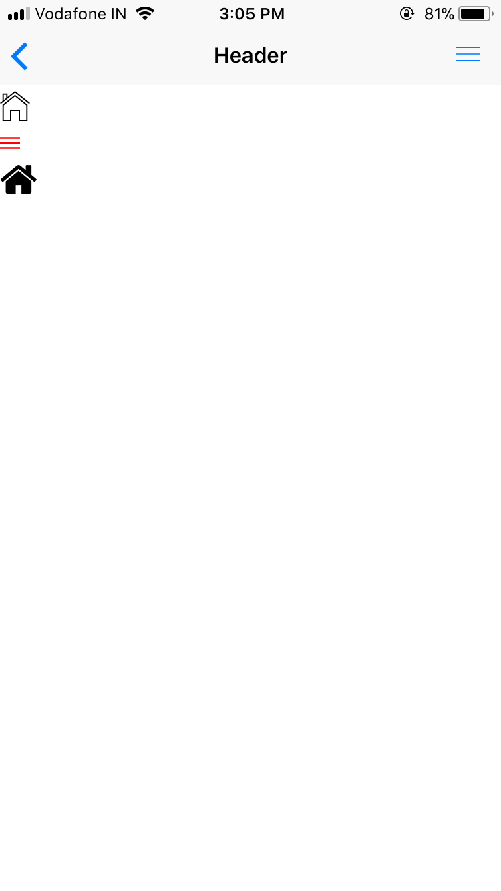
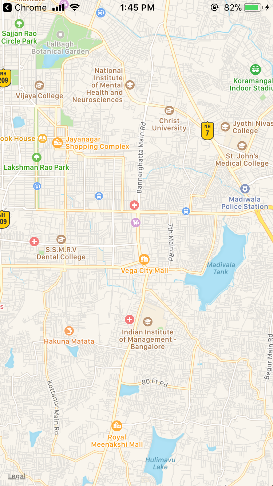

#### If you want to use a third party library refer to react-native packages instead of vuejs especially if the library uses render function or is dependent on html since vue-native does not work on html.

There are several contributions from the community that can be used in Vue-native and some of them are listed below :

## Icons

Usage of icons in Vue Native.

• Import and use the already available icons from the `@expo/vector-icons` for CRNA projects or `react-native-vector-icons` for non-crna projects (remember to link).
• Use PNGs as icons to get your own customized icons running.

We will be showing both these methods here.

### @expo/vector-icons

First install the React Native Elements package using the following command:

```shell
npm install @expo/vector-icons
```

Then you simply import it inside your `script` section like this:

```js
import { Ionicons } from "react-native-elements";
```

Also add the `Ionicons` imported in the `components` block.

```js
<script>
import { Ionicons } from "@expo/vector-icons";
export default {
  components: {Ionicons},
}
</script>
```

If you want to use the imported `Ionicons` globally, you will have to import the `Vue` component from the `vue-native-core` library which is already there if you created your project using the `vue-native-cli`.

Use the `Vue.component` function in your root file `App.vue` to specify the component that will be used globally.

```js
import Vue from "vue-native-core";
Vue.component("ionicons", Ionicons);
```

Now you are ready to use the kebab-case equivalent of the import in your `template` with the desired icon.

```html
<template>
  <view class="container">
    <ionicons name="md-checkmark-circle" size=92 color="green" />
  </view>
</template>
```

<div class="hello-world-container">
  <div class="hello-world-wrapper">
    
  </div>
</div>

### Icon images

If you know how to use the React Native `<Image>` component this will be a breeze.

```html
<template>
  <view class="container">
    <image
        :source="require('./logo.png')"
        class="imagestyle"
      />
  </view>
</template>
```

```css
<script>
.imagestyle{
  width: 100;
  height: 100;
}
</script>
```

## Maps

A Map component that uses Apple Maps or Google Maps on iOS and Google Maps on Android.

For non-crna Vue-Native projects, use the `react-native-maps` and link them.

For Vue-Native projects created with Crna, mapView from `expo` can be diretly used as shown below :

```html
<template>
  <view  class="container">
    <map-view class="container"
        :initial-region="coordinates"
      />
  </view>
</template>

<script>
import { MapView } from "expo";
export default {
    data: function() {
    return {
      coordinates: {
        latitude: 12.91074,
        longitude: 77.5996363,
        latitudeDelta: 0.0922,
        longitudeDelta: 0.0421
      }
    };
  },
   components: {
    MapView
  }
};
</script>
<style>
.container {
  flex: 1;
}
</style>
```

<div class="hello-world-container">
  <div class="hello-world-wrapper">
    
  </div>
</div>

## Lottie

[Lottie](https://airbnb.design/lottie) is the animation library from AirBnB and Expo has the default support it.

```html
<view class="container">
    <lottie
      ref="lottieAnimation"
      :style="{
        width: 400,
        height: 400,
        backgroundColor: '#eee',
      }"
      :source="animation ? animation  : {}"
    />
    <view class="button-container">
        <button title="Start Animation" :on-press="playAnimation" />
    </view>
</view>
```

```JS
<script>
import lottieAnimationJson from "./lottieAnimation.json";
import { DangerZone } from "expo";
const { Lottie } = DangerZone;

export default {
  components: { Lottie },
  data: function() {
    return {
      animation: null
    };
  },
  methods: {
    async loadAnimationAsync() {
      try {
        const lottieAnimationJsonResponse = await fetch(
          "https://cdn.rawgit.com/airbnb/lottie-react-native/635163550b9689529bfffb77e489e4174516f1c0/example/animations/Watermelon.json"
        );
        const parsedJson = await lottieAnimationJsonResponse.json();
        this.animation = parsedJson;

        this.playAnimation();
      } catch (error) {
        console.log(
          "%c some inside loadAnimationAsync ",
          "background: salmon; color: black",
          error
        );
      }
    },
    playAnimation() {
      if (!this.animation) {
        this.loadAnimationAsync();
      } else if (this.$refs.lottieAnimation) {
        this.$refs.lottieAnimation.reset();
        this.$refs.lottieAnimation.play();
      }
    }
  },
  mounted() {
    this.playAnimation();
  },
  beforeUpdate() {
    this.playAnimation();
  }
};
</script>
```

```css
<style>
.container {
  background-color: #fff;
  align-items: center;
  justify-content: center;
  flex: 1;
}
.button-container {
  padding-top: 20;
}
</style>
```

<div class="hello-world-container">
  <div class="hello-world-wrapper">
    
  </div>
</div>

## Native base

Refer [here](https://docs.nativebase.io/docs/GetStarted.html) to know how to use Native Base in Vue-native.

## GraphQl

We can use ApolloProvider and Query Component from react-apollo to implement graphQl in vue-native. The vue-apollo cannot be used since it's based on dynamic render function.

```html
<template>
   <view class="container">
    <apollo-provider :client="client">
      <query :query="cquery">
        <view render-prop-fn="children">
          <text v-if="args.loading">Loading...</text>
          <text v-else-if="args.error">An error occured</text>
          <view v-if="args.data && args.data.lookup">
            <text v-for="album in args.data.lookup.artist.releaseGroups.edges">
              {{album.node.title}}
            </text>
          </view>
        </view>
      </query>
    </apollo-provider>
   </view>
</template>
```

```js
<script>
import { ApolloClient } from 'apollo-client';
import { HttpLink } from 'apollo-link-http';
import { InMemoryCache } from 'apollo-cache-inmemory'
import { ApolloProvider, Query } from 'react-apollo';

const client = new ApolloClient({
  link: new HttpLink({ uri: 'https://graphbrainz.herokuapp.com/' }),
  cache: new InMemoryCache()
});

import { GET_NAMES } from "./queries.js";
export default {
  data: {
    client: client,
    cquery: GET_NAMES
  },
  components: { ApolloProvider, Query }
};
</script>
```

queries.js
```js
import { gql } from "apollo-boost";

export const GET_NAMES = gql`
  query NirvanaAlbumSingles {
    lookup {
        artist(mbid: "5b11f4ce-a62d-471e-81fc-a69a8278c7da") {
        name
        releaseGroups(type: ALBUM) {
          edges {
            node {
              title
              firstReleaseDate
            }
          }
        }
      }
    }
  }
`;
```

<!-- (https://docs.nativebase.io/docs/GetStarted.html) -->
